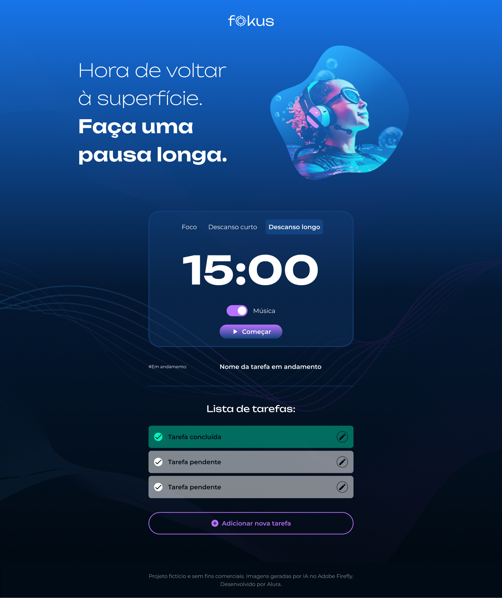

<h1 align="center"> Fokus </h1>

JavaScript: Manipulando dados com DOM e Armazenando dados no navegador.    

Professores Luan Alves e João Vitor Pereira na plataforma da Alura - O design foi feito por Isadora Cardoso

  <a href="#-tecnologias">Tecnologias</a>&nbsp;&nbsp;&nbsp;|&nbsp;&nbsp;&nbsp;
  <a href="#-projeto">Projeto</a>&nbsp;&nbsp;&nbsp;|&nbsp;&nbsp;&nbsp;
  <a href="#-layout">Layout</a>&nbsp;&nbsp;&nbsp;|&nbsp;&nbsp;&nbsp;
  <a href="#memo-licença">Licença</a>

  

## 🚀 Tecnologias

Esse projeto foi desenvolvido com as seguintes tecnologias:

- HTML e CSS
- JavaScript
- Git e Github
- Figma

## 💻 Projeto

O Fokus é um facilitador para utilização da técnica Pomodoro no dia a dia, facilitando o gerenciamento de tempo.

## 🔖 Layout

Você pode visualizar o layout do projeto através [DESSE LINK](https://www.figma.com/file/dEaMv34Wd5G7TBMPo8fPlK/Projeto-Fokus?type=design&node-id=35-181&mode=design&t=LAT1sRjnrDVABDMI-0). É necessário ter conta no [Figma](https://figma.com) para acessá-lo.

## 👍 Licença

Esse projeto está sob a licença MIT.

---

Feito na formação Alura ♥ 

